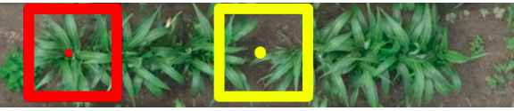

## Tech Test: Computer Vision

### Task1: Coding - NDVI Calculation  
To compute the NDVI for each pixel in the following steps were carefully followed.  

**Step1: Reading the TIFF images**  
A special package for manipulating TIFF images calaled [rasterio](https://rasterio.readthedocs.io/en/stable/) to read the TIF images. A `read_image()` function in the `script.py` is used to read the imagaes. The directory `DJI_202405031358_001` contains all the provided images and this directory has to be in the same path as the script file for the code to work.  
Note: Since only the NIR and TIF bands are required to compute NDVI, for each of the 10 provided images, only the pixels of the corresponding NIR-RED pair of bands are used.

**Step2:  Extracting metadata from the TIFF images**  

Most of the values required to compute NDVI are found in the metadata of the NIR and RED bands. So it's required to extract these values from the images. For this a `get_metadata(file_path)` function was implemented to extract these metadata and save them in json file with the same name as the image itself. In the json file, only the values of the metadata that are required in the NDVI computation are saved.  

**Step3: Correcting distoritions and alignment**  
To ensure that the images from both the NIR and RED spectral bands are perfectly aligned with each other and free from any distortions, four step corrections are applied.  
- `vignette correction`: A `correct_vignette(image)` function is implemented in the script to correct for vignetting effect at the corners of each of the NIR and RED band images. The formula for correcting this effect is:  

$$I_{(x, y)} \times\left(k[5] \cdot r^6+k[4] \cdot r^5+\cdots+k[0] \cdot r+1.0\right)$$  
where  
$$r=\sqrt{(x-\text { Center } X)^2+(y-\text { Center } Y)^2}$$  
and `Center X`, `Center Y`, and `K` are obtained from the json file, `x` and `y` are pixel coordinates.  

<p style="text-align:center;">
<figure>

<figcaption>before and after correcting vignette</figcaption>
</figure>
</p>

- `Distorition correction`: A fuction called `undistort_image(image):` is implemented to correct distortions. Obtaining all the parameters required for undistorting from metadata json file, a camera matrix and distortion coefficients are constructed and OpenCV's `undistort()` function is used.  
<p style="text-align:center;">
<figure>

<figcaption>before and after distortion correctoin</figcaption>
</figure>
</p>

- `Alignment`: A function from OpenCV called `warpPerspective` is used to correct the misalignment.For this a xx3 projective transformation matrix is obtained from the metadata json file of that image using the `Calibrated Hmatrix` key.  

<p style="text-align:center;">
<figure>

<figcaption>before and after alignment</figcaption>
</figure>
</p>

- `Align difference due exposure time`: Before aligning, a Guassian filter is applied to the images and then edge detection (Sobel filter) and Enhanced Correlation Coefficient (ECC) Maximization are used for aligning. For this, function called `align_exposure_diffs(tgt_path, src_path):` is implemented in the script file.


**Step4: NDVI calculation**  
After correcting and aligning the NIR and RED images, NDVI for each pixel is computed using the folloiwng formula.  
$$\mathrm{NDVI}=\frac{N I R_{\text {ref }}-\text { Red }_{\text {ref }}}{N I R_{\text {ref }}+\text { Red }_{\text {ref }}} =$$

$$\left(\frac{N I R_{\text {camera }} \times p \operatorname{Cam}_{N I R}}{N I R_{L S} \times p L S_{N I R}}-\frac{\text { Red }_{\text {camera }} \times p \text { Cam }_{R e d}}{\operatorname{Red}_{L S} \times p L S_{R e d}}\right) /\left(\frac{N I R_{\text {camera }} \times p \operatorname{Cam}_{N I R}}{N I R_{L S} \times p L S_{N I R}}+\frac{\operatorname{Red}_{\text {camera }} \times p C a m_{R e d}}{R e d_{L S} \times p L S_{R e d}}\right)$$  
where  
$$
\text{NIR}_{\text{camera}} = \frac{(I_{\text{NIR}} - I_{\text{BlackLevel}})}{\text{NIR}_{\text{gain}} \times \left(\frac{\text{NIR}_{\text{etime}}}{10^6}\right)}  
$$   
- I<sub>NIR</sub> and I<sub>blackLevel</sub> are the normalized raw pixel values and the black level values respectively. NIR<sub>gain</sub> and NIR<sub>etime</sub> are the sensor gain and exposure time respectively and they are obtained from the metadata.  These values are also computed for the RED band in similar way.
- <sub>p</sub>Cam<sub>NIR</sub> is a sensor gain adjustment obtained from the meatadata.  
- Values related to sun light sensors that are used in the NDVI calculation are NIR<sub>LS</sub> * <sub>p</sub>LS<sub>LS</sub>. This product is obtained as single value from the metadata as irradiance.  

Once all symbols for computing the NDVI are set, NDVI is computed the formula stated. For this a function `calculate_ndvi(nir, red)` is implemented in the script file. It requires path to the NIR and RED band pairs of an image. The following is the resulting plot of the NDVI of the first image in the provided images.  

<p style="text-align:center;">
<figure>

<figcaption>NDVI plot</figcaption>
</figure>
</p>

- this is the ndvi of each pixel  

ndvi =  
[[0.83676    0.83676034 0.83676046 ... 0.83676547 0.8367654  0.8367604 ]  
 [0.83676016 0.83676475 0.83676445 ... 0.83676565 0.8367657  0.83676   ]  
 [0.83676016 0.8367647  0.8367649  ... 0.83676565 0.8367656  0.8367601 ]  
 ...  
 [0.8367609  0.8367648  0.83676463 ... 0.83676606 0.8367655  0.83676136]  
 [0.83676046 0.8367646  0.8367645  ... 0.83676606 0.83676565 0.8367613 ]  
 [0.8367605  0.83676475 0.836765   ... 0.836763   0.83676285 0.8367615 ]]  


 ## Task 2: Plant Center Detection Using RGBD Images

### Objective:
Develop a concept to determine the center of the plant in the 
images using image processing techniques.

## Concept to determine center of plant in RGBD images using machine learning
After doing a bit of hunt on how to determine the center a plant from RGBD images, I came up with the following machine learning algorithm(ML) which is backed with a research paper by [Yuhao Chen](https://ieeexplore.ieee.org/stamp/stamp.jsp?tp=&arnumber=8265448). 
```
Algorithm LocatePlantCenter

Input: RGBD image
Output: Coordinates of crop plant centers

1. Preprocessing:
    1.1. Extract RGB channels and depth channel from RGBD image
    1.2. Convert RGB image to grayscale
    1.3. Define classification window size w

2. Initialize:
    2.1. Define Gabor filter parameters (orientations and frequencies)
    2.2. Initialize MILBoost classifier

3. Train MILBoost Classifier:
    a. For each training image:
        i. Extract candidate plant center locations (P)
        ii. For each candidate P:
            - Extract window W(P) of size w centered at P from both grayscale and depth images
            - Compute Gabor features for W(P) from grayscale image
            - Compute additional features from W(P) from depth image (e.g., texture, edges, gradients)
        iii. Combine grayscale and depth features
        iv. Create bags of instances for MIL
        v. Label each bag (positive if it contains a plant center, negative otherwise)
        vi. Train MILBoost classifier using labeled bags

4. Classify Image Pixels:
    a. For each pixel P in the input image:
        i. Extract window W(P) of size w centered at P from both grayscale and depth images
        ii. Compute Gabor features for W(P) from grayscale image
        iii. Compute additional features for W(P) from depth image
        iv. Combine grayscale and depth features
        v. Classify W(P) using the trained MILBoost classifier
        vi. Assign classification score to P

5. Post-processing:
    a. Generate mask of estimated plant centers from classification scores
    b. Identify clusters in the mask, DBSCAN can be used here. ##https://scikit-learn.org/stable/modules/clustering.html#dbscan
    c. Calculate centroids of largest cluster to determine plant center

6. Output the coordinate of the identified plant center

End Algorithm

```
    
    
    
The idea is to train ML model to detect the plant center from a bunch of images and use the model to detect plant center of any unseen RGBD image. The algorithm is called Multiple Instance Learning(MIL) where training data is arranged in sets called `bags`. Bags are labeled according to the instance they contain. A bag is labeled positive if it contains at least one positive instance. A bag is labeled negative if it contains no positive instances. W(P) in the pseudo code is a square window of size `w` in the grayscale image centered at pixel P. The Gabor filter in the grapy scale images takes into account the plant orientation.


## Answer to the question on pose estimation
If the number of keypoints to estimate their pose is not fixed, the traditional pose estimation models may fail to accurately estimate the pose. One additional layer of complexity should be added to the pose estimation process to account for the unknown number of keypoints. Or using flexible architectures that adapt to varying number of keypoints such as Graph Neural Network(GNN) that take variable size inputs can be used.